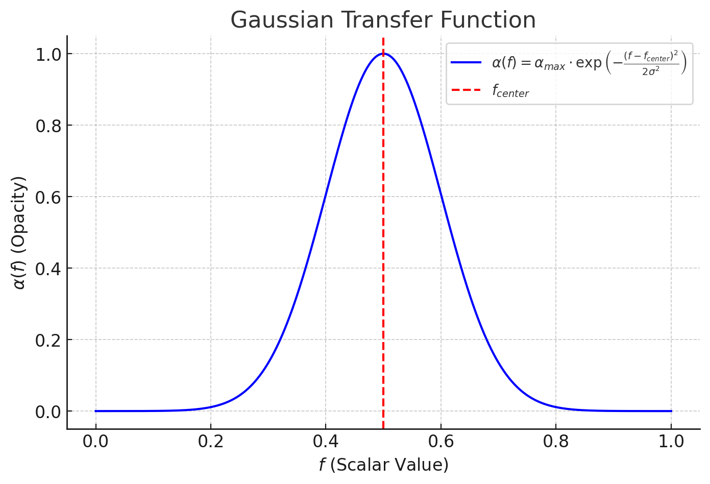

## 概論
ボリュームレンダリングとは、3D空間内の体積データ（スカラー値の分布）を可視化し、
色と透明度を目的に合った転送関数を利用してスカラー値から内部構造を可視化を行う技術。

### 実現手法
#### 直接ボリュームレンダリング (Direct Volume Rendering, DVR):
- レイキャスティング (Ray Casting)
  - 転送関数を利用
- レイトレーシング (Ray Tracing)
  - 転送関数を利用
- スプライトベースのレンダリング
  - 転送関数を利用
  - ボリュームデータをスプライトに分割し、カメラ方向に重ねて表示
- 平面積み上げ (Slice-Based Rendering)
  - 転送関数を利用
  - ボリュームデータを2Dスライスに分割し、それをカメラ方向に積み上げて投影

#### 間接ボリュームレンダリング (Indirect Volume Rendering):
- マーチングキューブ (Marching Cubes):
  - 転送関数を利用しない手法
  - スカラー値の等値面をポリゴン（メッシュ）として抽出し、ポリゴン表面をレンダリングするため、
    スカラー値を色や透明度に変換する必要がない
  - ただし、ポリゴン表面にシェーディングや色付けをする際にスカラー値を参照することはある
- マーチングタイル (Marching Tetrahedra):
  - マーチングキューブの改良版で、非直交格子でも等値面を抽出可能。
  - マーチングキューブと同様に等値面抽出に特化した手法で、転送関数は必要
- サーフェスネッティング (Surface Netting):
  - 主にスカラー値から等値面を生成する手法で通常、転送関数は直接使用されない。
    しかし、可視化やシェーディングの際には、転送関数が補助的に使用される場合がある
  - スカラー値の変化を基に表面を生成するシンプルな手法。

#### ハイブリッド手法
- シェーディング付きボリュームレンダリング (Shaded Volume Rendering):
  - レイキャスティングにライティングモデルを追加し、陰影や光の反射を計算。
- 半透明レンダリング (Translucent Rendering):
  - 複数のボリュームを重ねて透明度のある表現を行う。

#### その他の特化手法
- テクスチャマッピングベースの手法:
  - ボリュームデータを3Dテクスチャとして保存し、GPUでレンダリングを実行。
- ボリュームスプラッティング (Volume Splatting):
  - 各ボクセルをポイントとしてプロジェクションし、重ね合わせて画像を生成。
- ハイブリッドレイマーチング (Hybrid Ray Marching):
  - レイキャスティングとマーチングキューブを組み合わせて、表面と内部を同時に描画。
- アダプティブサンプリング (Adaptive Sampling):
  - レイキャスティング時にスカラー値の変化が少ない領域をスキップ。
- オクツリー分割 (Octree Decomposition):
  - ボリュームデータをツリー構造に分割して、高解像度の領域のみ詳細にレンダリング。
- LOD（Level of Detail）:
  - 視点距離に応じてデータの解像度を動的に変更。

### 転送関数（Transfer Function）
ボリュームレンダリングにおいてスカラー値を色と透明度にマッピングしてデータを視覚化するための関数

- 色はスカラー値の分布をヒートマップで表示したり、異なる材質を色で区別する目的
- 透明度は
  1. スカラー値がある閾値を超えると透明度が急激に変化するようなステップ関数を用いる
  2. スカラー値を線形に透明度に反映させる。成分濃度や粒子分布などに用いる
  3. スカラー値が特定の値の範囲の透明度を１（不透明）にして特定の構造を浮かび上がらせる。ガウス関数を用いる。
    $$
      \alpha(f)=\alpha_{max} \cdot \exp{ \left(- \frac{(f-f_{center})^2}{2\sigma^2} \right)}
    $$
  4. CTスキャンで異なる材質を区別したり、地質データで異なる密度を持つ層を強調
    $$
    \alpha(f) =
    \begin{cases} 
    0, & f < f_1 \\
    k_1 \cdot (f - f_1), & f_1 \leq f < f_2 \\
    k_2, & f_2 \leq f < f_3 \\
    \alpha_{max}, & f \geq f_3
    \end{cases}
    $$
    - **範囲 $f_1$ から $f_2$**:
      - 透明度が線形的に増加する範囲。
      - スカラー値がこの範囲にある部分を段階的に強調します。
    - **範囲 $f_2$ から $f_3$**:
      - 透明度が一定値 $k_2$ に保たれる範囲。
      - 特定のスカラー値に対応する構造を明確に表示。
    - **範囲 $f_3$ 以降**:
      - 透明度が最大値 $\alpha_{max}$ に設定され、スカラー値が高い部分を完全に可視化します。
  5. 光が霧や煙を通る時のように、スカラー値が増加するにつれて急激に不透明になり、光の減衰をモデル化
    $$
      \alpha(f)=1-e^{-k\cdot f}
    $$

転送関数 $ \tau(f) $ は

###### 色の計算
スカラー値 $ f $ を RGB 値にマッピングする関数 $ \tau_{color}(f) $：
$$
\mathbf{C}(f) = \tau_{color}(f) = \begin{bmatrix} C_r(f) \\ C_g(f) \\ C_b(f) \end{bmatrix}
$$

- $ C_r(f), C_g(f), C_b(f) $ はそれぞれ赤、緑、青の成分を表す関数です。

###### 透明度の計算
スカラー値 $ f $ を透明度にマッピングする関数 $ \tau_{alpha}(f) $：
$$
\alpha(f) = \tau_{alpha}(f)
$$

- $ \alpha(f) $ は $[0, 1]$ の範囲で透明度を示します。

---

##### 転送関数の特性

###### 線形転送関数
スカラー値を一定のスケールで色と透明度に変換します。
$$
\tau_{color}(f) = \mathbf{k}_c f, \quad \tau_{alpha}(f) = k_a f
$$

ここで：
- $ \mathbf{k}_c $ は色のスケール係数
- $ k_a $ は透明度のスケール係数

###### 非線形転送関数
対数や指数関数を用いて非線形変換を行います。
$$
\tau_{color}(f) = \log(1 + f), \quad \tau_{alpha}(f) = 1 - e^{-kf}
$$

ここで：
- $ k $ は調整パラメータ

---

##### 転送関数を用いた積分

転送関数を用いることで、レイ上の光の寄与を次の積分式で計算します：
$$
\mathbf{C}_{final} = \int_{t_{start}}^{t_{end}} \mathbf{C}(f(\mathbf{r}(t))) \alpha(f(\mathbf{r}(t))) e^{-\int_{t_{start}}^t \alpha(f(\mathbf{r}(t'))) dt'} dt
$$

この式は：
- $ \mathbf{C}(f(\mathbf{r}(t))) $: スカラー値から計算された色
- $ \alpha(f(\mathbf{r}(t))) $: スカラー値から計算された透明度
- $ e^{-\int \alpha} $: 光の減衰を考慮した項

数値的な計算では、この積分を離散化して次のように表します：
$$
\mathbf{C}_{final} \approx \sum_{i=0}^{N} \mathbf{C}(f(\mathbf{r}(t_i))) \alpha(f(\mathbf{r}(t_i))) \prod_{j=0}^{i-1} e^{-\alpha(f(\mathbf{r}(t_j))) \Delta t}
$$

---

##### 実装への応用

転送関数は次のステップで適用されます：
1. **スカラー値の取得**: ボリュームデータからサンプリング。
2. **色と透明度のマッピング**: 転送関数を適用して $ \mathbf{C}(f) $ と $ \alpha(f) $ を計算。
3. **積分による光の寄与の計算**: 光学モデルを用いて色を合成。

これにより、複雑な内部構造を視覚化することが可能になります。

#### 計算
サンプリングされたスカラー値は、**転送関数** $$ \tau(f) $$ を用いて色 $$ \mathbf{C}(f) $$ と透明度 $$ \alpha(f) $$ にマッピングされます。

- 色の計算:
  $$
  \mathbf{C}(f) = \tau_{color}(f)
  $$

- 透明度の計算:
  $$
  \alpha(f) = \tau_{alpha}(f)
  $$

これらを基に、レイ上の光の寄与を積分します。$$ t $$ の範囲 $$[t_{start}, t_{end}]$$ における色と透明度の計算式は次のようになります：
$$
\mathbf{C}_{final} = \int_{t_{start}}^{t_{end}} \mathbf{C}(f(\mathbf{r}(t))) \alpha(f(\mathbf{r}(t))) e^{-\int_{t_{start}}^t \alpha(f(\mathbf{r}(t'))) dt'} dt
$$

この式は物理的に正確な色の寄与を表しますが、数値的に計算する場合は離散化して実装します。

---

## 数値積分
数値積分では、区間 $$[t_{start}, t_{end}]$$ を離散化して、以下のように計算します：

$$
\mathbf{C}_{final} \approx \sum_{i=0}^{N} \mathbf{C}(f(\mathbf{r}(t_i))) \alpha(f(\mathbf{r}(t_i))) \prod_{j=0}^{i-1} e^{-\alpha(f(\mathbf{r}(t_j))) \Delta t}
$$

ここで、$$ \Delta t $$ はサンプリング間隔です。この計算は各サンプリング点で繰り返されます。

---

## レイキャスティングの重要なポイント
1. **精度とパフォーマンスのトレードオフ**:
   サンプリング間隔 $$ \Delta t $$ を小さくすると精度が上がるが、計算コストも増加。

2. **転送関数の設計**:
   適切な転送関数を設計することで、必要な情報を効果的に可視化可能。

3. **GPUでの最適化**:
   GLSLなどのシェーダーを使い、レイキャスティングをリアルタイムで実行可能。

---

## 実装への応用
この数学的基礎を元に、GLSLでのレイキャスティング実装では以下のような流れをコード化します：
1. レイの生成（カメラと画面上のピクセル位置から方向ベクトルを計算）。
2. ボクセルとの交差判定。
3. サンプリングと転送関数の適用。
4. 積分による色と透明度の計算。

これらを活用して、Three.jsやGLSLでボリュームレンダリングを実現します。

### 1. レイキャスティング
- 3次元空間内に分布するスカラー値（温度）やボクセル（密度）に対して、仮想的な光線（レイ）が通過する経路上のデータ
を可視化する手法で、これらのスカラー値は、転送関数を用いて色と透明度に変換され、光の寄与を積分することでデータの可視化が実現される

- 透明度（Alpha値）は
  - 内部構造の可視化: レイが通過する経路上のデータを透明度で表現し、奥行きや重なりを視覚化
  - 重要領域の強調: データの特定範囲（例えば高密度部分）を強調表示し、それ以外を半透明にすることで解析を容易にする
  - 光学的リアリズム: 光の吸収や散乱をシミュレートするために透明度を利用し、リアルな視覚効果を再現

- 例
  - CTスキャンデータでは各ボクセルにおける密度値がスカラー値として利用される
  - 人体のCTスキャンでは、骨や臓器の密度に応じて透明度を設定し、重なった部分を視覚化
光の散乱や吸収をモデル化する際、透明度が光の減衰を計算する重要なパラメータになります。

- シェーダープログラム（GLSLやHLSL）で効率的な処理
  - HLSLはDirectX/Microsoft環境
- 3D Slicer、ParaView、VisIt などのアプリ

#### 用語説明 ボクセル

ボクセル (Voxel) は、Volume Element（体積要素） を略したもので、3次元空間を構成する最小単位のこと。2D画像でのピクセル（Pixel）が平面上の画素を指すのと同様に、ボクセルは3D空間内の画素に相当

- 各ボクセルは空間内で位置と値を立方体として表現、グリッド状に配置
- ボクセルには、密度、色、温度、圧力などのスカラー値やベクトル値が割り当てられる
- 使用用途例
  - 医療用CTスキャンでは、3Dデータが複数の2Dスライスとして保存され、それがボクセルデータを構成。
  - ボクセルは、Minecraftのようなボクセルベースのゲームでも使用
  - 流体シミュレーションや気象モデリング
  - 地質調査や材料の内部構造の可視化
- ファイル保存時の圧縮フォーマットは RLE, Octreeなど
- 3D Slicer、ParaView、MagicaVoxel等の可視化ソフトあり

## 関連するアルゴリズム一覧
        
| アルゴリズム名                    | 説明                                                                                 | 主な用途                                       |
|-----------------------------------|-------------------------------------------------------------------------------------|-----------------------------------------------|
| サンプリング (Sampling)           | 3Dボリュームデータを一定間隔でサンプリングして値を取得する方法                      | データの断片取得、レイキャスティングの基礎     |
| レイキャスティング (Ray Casting)   | レイをボリュームデータに投射し、交点やスカラー値を計算                              | ボリュームの可視化、密度評価                   |
| 線形補間 (Linear Interpolation)   | サンプリング点間で値を補間する方法                                                  | 解像度の低いデータの補完                       |
| 転送関数 (Transfer Function)      | スカラー値を色や透明度にマッピング                                                  | 可視化の強調、不要部分の除去                   |
| 積分法 (Integration)              | レイ上でのスカラー値を積分して光の強度や透明度を計算                                | 体積全体のレンダリング                         |
| フォノンモデリング (Photon Modeling)| 光子の散乱や吸収をモデル化                                                          | 光学効果のリアルな表現                         |
| マーチングキューブ (Marching Cubes)| 等値面（iso-surface）を抽出するアルゴリズム                                          | サーフェス抽出、間接的ボリュームレンダリング   |
| ボリュームサンプル構造             | データの効率的なサンプリングと格納方法                                              | メモリ使用量の最適化                           |
| ノーマル計算 (Normal Calculation) | 勾配を計算して法線ベクトルを取得                                                    | ライティング効果の強調                         |
| ライティングモデル (Lighting Model)| フォンシェーディングやランバートシェーディングをボリュームに適用                    | 影や光のリアルな表現                           |
| レイトレーシング (Ray Tracing)     | レイを使って光の反射や屈折をシミュレーション                                        | 光学的に正確なボリュームレンダリング           |
| データ補間 (Data Interpolation)   | データが欠落している場合に値を推定                                                  | データの補正、リアリズム向上                   |
| フィルタリング (Filtering)        | データに対するスムージングやエッジ強調                                              | ノイズ除去、特定領域の強調                     |
| ボクセルオクルージョン (Voxel Occlusion)| ボクセル間の遮蔽を計算して視覚効果を強調                                           | 影や光のリアリズム向上                         |

## レイキャスティング (Ray Casting) 

## 概要
レイキャスティングは、3Dボリュームレンダリングやグラフィックスで使用されるアルゴリズムで、レイ（光線）を仮想空間に投射し、その経路上のデータをサンプリングすることで可視化を行います。

レイキャスティングは主に次の手順で構成されます:
1. レイの生成
2. レイの進行
3. サンプリング
4. 色と透明度の計算（転送関数と積分）

---

### 例キャスティングの数学的基礎

#### 1. レイのパラメトリック表現
レイは始点 $ \mathbf{o} $ と方向ベクトル $ \mathbf{d} $ を用いて次のように表現されます：
$$
\mathbf{r}(t) = \mathbf{o} + t \mathbf{d}, \quad t \geq 0
$$

この表現は以下の幾何的関係を基に導出されます：
- 始点 $$ \mathbf{o} $$ をレイの基準位置とする。
- 方向ベクトル $$ \mathbf{d} $$ に沿って進む場合、任意の位置 $$ \mathbf{r} $$ は次のように表現されます：
  $$
  \mathbf{r} - \mathbf{o} = t \mathbf{d}
  $$
  $$ t $$ を両辺に適用して解くと、レイの一般式が得られます：
  $$
  \mathbf{r} = \mathbf{o} + t \mathbf{d}
  $$

- $$ \mathbf{o} $$: レイの始点（カメラの位置）
- $$ \mathbf{d} $$: レイの方向ベクトル（単位ベクトルとして正規化されることが多い）
- $$ t $$: レイの進行距離を示すパラメータ

#### 2. ボクセルとの交差判定
ボリュームデータは、ボクセル（3Dグリッド）として表現されます。レイがボクセル内を進む際、次のような条件を満たします：

1. **交差点の計算**:
   レイが各軸に沿った境界（$$ x, y, z $$）を通過する際のパラメータ $$ t $$ を計算します。
   $$
   t_{x} = \frac{x_{boundary} - o_x}{d_x}, \quad t_{y} = \frac{y_{boundary} - o_y}{d_y}, \quad t_{z} = \frac{z_{boundary} - o_z}{d_z}
   $$

2. **次の交差点の選択**:
   次に進む軸（$$ x, y, z $$）を以下のように選びます：
   $$
   t_{next} = \min(t_x, t_y, t_z)
   $$

#### 3. サンプリング
レイがボクセル内を通過する間、一定間隔 $$ \Delta t $$ でスカラー値をサンプリングします。$$ t $$ の範囲を $$[t_{start}, t_{end}]$$ とすると、サンプリングは以下のように進めます：
$$
\mathbf{r}(t_i) = \mathbf{o} + t_i \mathbf{d}, \quad t_i = t_{start} + i \Delta t, \quad i = 0, 1, 2, \ldots
$$

サンプリング点 $$ \mathbf{r}(t_i) $$ に対応するスカラー値 $$ f(\mathbf{r}(t_i)) $$ を取得します。

#### 4. 色と透明度の計算（転送関数と積分）

