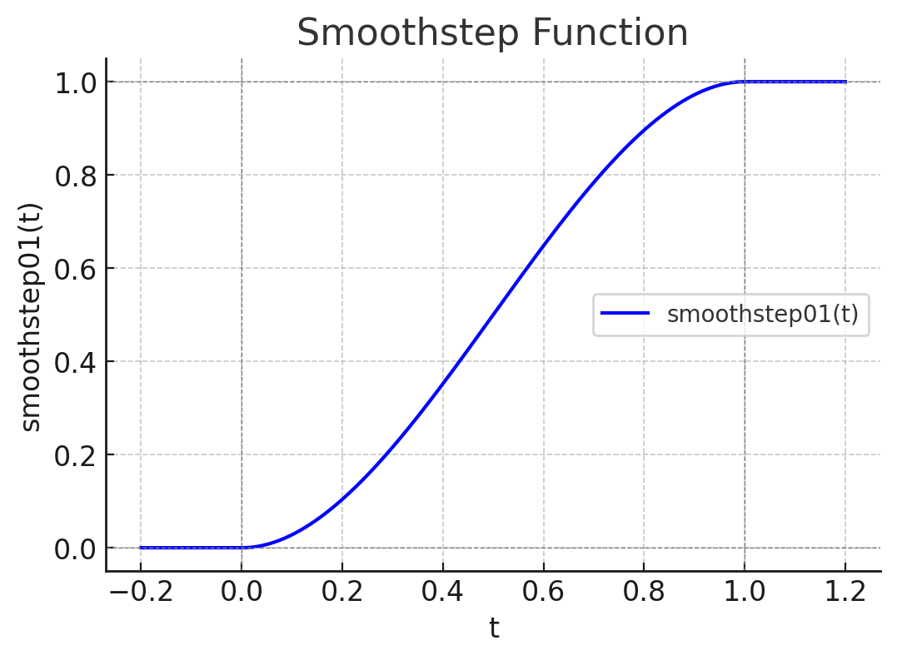
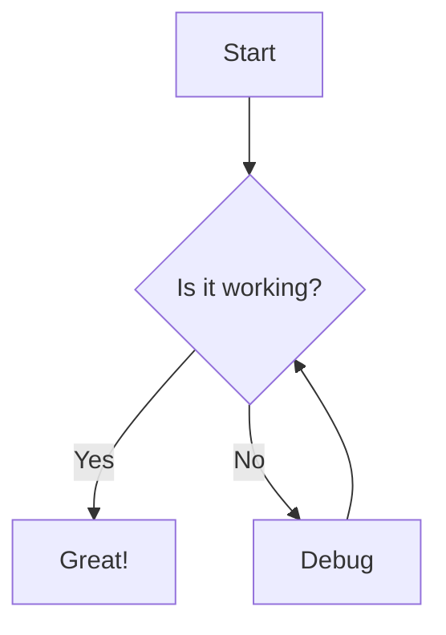

import CC from "../../../components/c-c.astro";
import CodeTitle from '../../../components/CodeTitle';
import MermaidChart from '../../../components/MermaidChart.astro';
import TimeStamp from '../../../components/TimeStamp';
import Box from '../../../components/Box';
import RedBox from '../../../components/RedBox';
import WhiteBox from '../../../components/WhiteBox';
import {TwoColumn,Left,Right}  from '../../../components/TwoColumn';
import StandardStyle from '../../../components/StandardStyle';

<StandardStyle />

---


##### TODOs

 - [ ] mermaidの状態遷移図のテキスト、フローチャートのテキストが右寄りになる
 - [ ] 左右のコンテンツの分け方がいびつになる。これでいいのか。

<TimeStamp fileUrl={import.meta.url} />

## TwoColumnコンポーネント
<TwoColumn>
  <Left>記載方法</Left>
  <Right>表示され方</Right>
</TwoColumn>


## image表示方法
- htmlの場合は、~/astro/pubic配下に配置
<TwoColumn>
  <Left>
   ```html
<center>
 
</center>
   ```
  </Left>

  <Right>
    <center></center>
  </Right>
</TwoColumn>

- markdownの場合はドキュメントのあるディレクトリが現ディレクトリになる
<TwoColumn>
  <Left>
   ```markdown
     
   ```
  </Left>

  <Right>
     
  </Right>
</TwoColumn>


## iframe表示方法
<TwoColumn>
 <Left>
```html
<center>
  <iframe 
    src='/html/texture.html' 
    style={{ height: '300px', width: '70%' }}
  />
</center>
```
 </Left>
 <Right>
<center>
  <iframe 
    src='/html/texture.html' 
    style={{ height: '300px', width: '70%' }}
  />
</center>

 </Right>
</TwoColumn>

## style付きでhtmlを記述
<TwoColumn>
<Left>
```html
<div style={{backgroundColor: 'violet', padding: '1rem'}}>
  Try and change the background color to `tomato`.
</div>
```
</Left>
<Right>
<div style={{backgroundColor: 'violet', padding: '1rem'}}>
  Try and change the background color to `tomato`.
</div>
</Right>
</TwoColumn>


## JavaScriptで表示
- mdx内部で直にJavaScriptを記述できる
- 中カッコで括る

<TwoColumn>
<Left>
```javascript
{(function () {
  const guess = Math.random()
  if (guess > 0.66) {
    return <span style={{color: 'tomato'}}>Look at us.</span>
  }
  if (guess > 0.33) {
    return <span style={{color: 'violet'}}>Who would have guessed?!</span>
  }
  return <span style={{color: 'goldenrod'}}>Not me.</span>
})()}

{2+232323}
```
</Left>
<Right>
{(function () {
  const guess = Math.random()

  if (guess > 0.66) {
    return <span style={{color: 'tomato'}}>Look at us.</span>
  }

  if (guess > 0.33) {
    return <span style={{color: 'violet'}}>Who would have guessed?!</span>
  }

  return <span style={{color: 'goldenrod'}}>Not me.</span>
})()}
{2+232323}
</Right>
</TwoColumn>


## Boxコンポーネント
<TwoColumn>
<Left>
```
<Box>
- abc
- def
</Box>
```
</Left>
<Right>
<Box>
- abc
- def
</Box>
</Right>
</TwoColumn>


## RedBoxコンポーネント
<TwoColumn>
<Left>
```
<RedBox>
- abc
- def
</RedBox>
```
</Left>
<Right>
<RedBox>
- abc
- def
</RedBox>
</Right>
</TwoColumn>

## WhiteBoxコンポーネント
<TwoColumn>
<Left>

```text
<WhiteBox>
- a
- b
- c
</WhiteBox>
```
</Left>
<Right>
<WhiteBox>
- a
- b
- c
</WhiteBox>
</Right>
</TwoColumn>


## TimeStampコンポーネント
<TwoColumn>
<Left>
```
<TimeStamp fileUrl={import.meta.url} />
```
</Left>
<Right>
<TimeStamp fileUrl={import.meta.url} />
</Right>
</TwoColumn>


## CodeTitleコンポーネント
- ソースコード表示時にタイトルを下部に表示する

<TwoColumn>
<Left>
````
<CodeTitle title="テクスチャのロード" id="load" counter="01">
```text
 some texts
```
</CodeTitle>
````
</Left>
<Right>
<CodeTitle title="テクスチャのロード" id="load" counter="01">
```text
 some texts
```
</CodeTitle>
</Right>
</TwoColumn>

## new mermaid
````

````


````
```js
console.log(1);
```
````


## Mermaidコンポーネント


<TwoColumn>
<Left>
```jsx
import MermaidChart from '../../../components/MermaidChart.astro';

<MermaidChart code={`
graph TD
    A[Start] --> B[uuauau]
    B --> C{Decision}
    C -->|Yes| D[End]
    C -->|No| E[Retry]
`} />
```
</Left>
<Right>
<MermaidChart code={`
graph TD
    A[Start] --> B[uuauau]
    B --> C{Decision}
    C -->|Yes| D[End]
    C -->|No| E[Retry]
`} />

</Right>
</TwoColumn>

### mermaidの表示例

#### シーケンスダイアグラム
<MermaidChart code={`
sequenceDiagram
    Alice->>John: Hello John, how are you?
    John-->>Alice: Great!
    Alice-)John: See you later!
`} />

#### 状態遷移

<MermaidChart code={`
---
title: Simple sample
---
stateDiagram
    [*] --> Still
    Still --> [*]

    Still --> Moving
    Moving --> Still
    Moving --> Crash
    Crash --> [*]

`} />

<MermaidChart code={`
mindmap
  root((mindmap))
    Origins
      Long history
      ::icon(fa fa-book)
      Popularisation
        British popular psychology author Tony Buzan
    Research
      On effectiveness<br/>and features
      On Automatic creation
        Uses
            Creative techniques
            Strategic planning
            Argument mapping
    Tools
      Pen and paper
      Mermaid
`} />


## MDXごとのstyleの変更
- styleを作ってimportしても反映されなかった。mdxファイル冒頭に表記するとスタイルが反映される
- 各MDXファイルで個別に変更しているが、共通化してインポートしたいが今のところできない

```css
 <style>{`
   .sl-markdown-content   div.ec-line {
       margin-top: 0 !important;
   }
   .sl-markdown-content  {
      font-size:15px;
   }
 `}</style>
```


## コンポーネントの直接挿入
mdxファイル内部でコンポーネントを記述し利用することも可能

```javascript
export const Red = ({ message, children, className }) => {
  return (
    <div className={className}>
      <span style={{ color: 'red' }}>{message}</span>
      <span>{children}</span>
    </div>
  );
};
import {Blue} from '../../../components/Blue';
<Red message='メッセージ'>umamama</Red>
<Blue message='メッセージ'>nekonekone</Blue>
```

export const Red = ({ message, children, className }) => {
  return (
    <div className={className}>
      <span style={{ color: 'red' }}>{message}</span>
      <span>{children}</span>
    </div>
  );
};
import {Blue} from '../../../components/Blue';

<Red message='メッセージ'>umamama</Red>

<Blue message='メッセージ'>nekonekone</Blue>


## 6. mermaidの利用
- コンポーネントを利用する
- クライアントサイドにjavascriptをダウンロードして画像が生成される


### 6-1.パッケージインストール
mermaidを利用するには以下のようなパッケージがastroの元で必須

- astro: Astro本体（必要）
- @astrojs/mdx: MDXをサポートするためのパッケージ（必要）
- @astrojs/react: AstroとReactを統合するためのパッケージ（必要）
- @astrojs/starlight: Starlightテーマ（必要）
- mermaid: Mermaid自体のライブラリ（必要）
- remark-mermaidjs: Markdown内でMermaidを利用するためのパッケージ（必要）

### 6-2.設定
remarkPluginsにremarkMermaidを追加する


```javascript
export default defineConfig({
    integrations: [// ここを最初に配置
        react(),
        expressiveCode(),
        mdx(), sitemap(), starlight({
            title: 'ドキュメント',
            social: {
                github: 'https://github.com/withastro/starlight',
            },
            sidebar: [
                {
                    label: 'THREE.js',
                    autogenerate: {directory: 'three'},
                },                
                {
                    label: 'メディア操作',
                    autogenerate: {directory: 'algorithm'},
                },                
                {
                    label: '技術レポート',
                    autogenerate: {directory: 'tech'},
                },                
                {
                    label: '開発関連書類',
                    autogenerate: {directory: 'dev'},
                },                
                {
                    label: 'その他',
                    autogenerate: {directory: 'reports'},
                },                
                {
                    label: 'etc',
                    autogenerate: {directory: 'etc'},
                },                
            ],
        })
    ],
    markdown: {
        remarkPlugins: [remarkMath,remarkMermaid],
        rehypePlugins: [rehypeKatex],
    },
```

### 6-3.mermaid用コンポーネント定義

```javascript
---
import mermaid from 'mermaid';
export interface MermaidProps {
  code: string;
}
const { code } = Astro.props;
---
<div class="mermaid">
  {code}
</div>

<script>
  import mermaid from 'mermaid';
  mermaid.initialize({ startOnLoad: true });
  mermaid.contentLoaded();
</script>
```

### 6-4.利用
コンポーネントをインポートしmermaidを記述する


## install, server設置
- node.js
- npm
- astro/starlight
```bash
> npm create astro@latest .
```
- serveの利用
```bash
> npm install -g serve
> npm run build
> serve dist/ -l 8080
```
